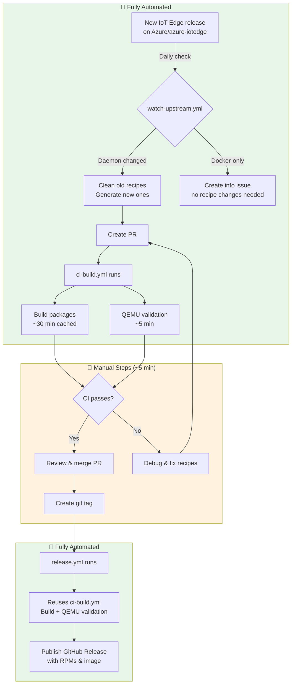

# Yocto + IoT Edge Release Guide

This guide covers the IoT Edge release process for Yocto Scarthgap (main branch) and Kirkstone (kirkstone branch).

## Release Flow



## On-Call Checklist

1. **Wait for automated PR** — `watch-upstream.yml` creates it daily at 6:00 UTC
2. **Check CI status** — Both "Build packages" and "QEMU validation" must pass
3. **Merge the PR**
4. **Tag the release** (PR description includes exact commands):

   ```bash
   git pull origin main
   git tag 1.5.35
   git push origin 1.5.35
   ```

5. **Verify** — Check [GitHub Releases](https://github.com/Azure/meta-iotedge/releases)

## How Automation Works

### Version Detection

- **Source**: [product-versions.json](https://github.com/Azure/azure-iotedge/blob/main/product-versions.json) in Azure/azure-iotedge
- **Release version**: The overall product version (e.g., `1.5.35`) — used for recipe versioning and tags
- **Daemon version**: The `aziot-edge` component version (e.g., `1.5.21`) — determines if update is needed
- **Significant vs Docker-only**: If daemon version changed → update recipes; Docker-only → info issue

The workflow uses `scripts/check-upstream.sh` to fetch `product-versions.json` and compare versions. You can run this locally to test:

```bash
./scripts/check-upstream.sh         # Key=value output
./scripts/check-upstream.sh --json  # JSON output
```

### GitHub Actions Workflows

| Workflow                 | Trigger                    | Purpose                                                |
| ------------------------ | -------------------------- | ------------------------------------------------------ |
| `watch-upstream.yml`     | Daily 6:00 UTC             | Detects new releases, generates recipes, creates PRs   |
| `ci-build.yml`           | PR/push events             | Builds packages, QEMU validation (self-hosted runner)  |
| `release.yml`            | Git tag push               | Publishes to GitHub Releases                           |
| `build-devcontainer.yml` | `.devcontainer/**` changes | Rebuilds devcontainer image                            |

> **Note:** CI runs on a self-hosted runner with persistent sstate-cache, making incremental builds much faster (~30 min vs ~4 hours). First builds or builds with recipe changes may take longer.

### Recipe Management

- Old recipes are automatically removed when updating to a new version
- Git tags preserve history — checkout a tag to get old recipes: `git checkout 1.5.5`

## Branch Mapping

| Branch    | Yocto Release       | Script Parameter |
| --------- | ------------------- | ---------------- |
| main      | Scarthgap (5.0 LTS) | `scarthgap`      |
| kirkstone | Kirkstone           | `kirkstone`      |

## Manual Recipe Updates

When automation fails or you need manual control:

### Prerequisites

```bash
cargo install --locked cargo-bitbake
```

### Update Recipes

```bash
./scripts/update-recipes.sh --iotedge-version 1.5.35 --clean
```

The script:
1. Fetches `product-versions.json` from the specified IoT Edge release tag
2. Resolves git SHAs from version tags
3. Generates `*.bb` and `*.inc` files via cargo-bitbake
4. Normalizes cargo sources and fixes license checksums

Use `--keep-workdir` to debug generated files.

### Validate Recipes

Quick syntax check (~1 min):

```bash
./scripts/fetch.sh scarthgap
cd poky && source oe-init-build-env && bitbake -p iotedge aziot-edged
```

Full build (hours):

```bash
./scripts/build.sh scarthgap
```

QEMU validation (after build):

```bash
./scripts/validate-qemu.sh scarthgap
```

### Devcontainer

Both local development and CI use the same devcontainer image (`ghcr.io/<owner>/meta-iotedge-devcontainer:scarthgap`). In the devcontainer, `scripts/build.sh` runs `scripts/bitbake.sh` directly (no Docker nesting):

```bash
export DEVCONTAINER=1
export TEMPLATECONF="meta-iotedge/conf/templates/scarthgap"
./scripts/bitbake.sh iotedge aziot-edged
```

The CI workflow mounts a persistent cache directory at `/workspaces/yocto-cache` for sstate-cache and downloads, enabling fast incremental builds.

## QEMU Validation

The `validate-qemu.sh` script boots the QEMU image and checks:

- `iotedge --version` — CLI installed
- `iotedge check --verbose` — Diagnostics
- Service status — keyd, certd, tpmd, identityd, aziot-edged

**Expected without Azure config:**

- ✅ Services running: keyd, certd, tpmd, identityd
- ⚠️ Configuration warnings (no config.toml)
- ❌ aziot-edged needs config to fully start

This confirms packages are installed correctly. Full functionality requires Azure IoT Hub provisioning.

### Manual SSH Access

```bash
sshpass -p '' ssh -o StrictHostKeyChecking=no -p 2222 root@localhost
```

## Troubleshooting

### SRCREV = "main" errors

```text
ERROR: iotedge: Fetcher failure: Unable to find revision main in branch main
```

Recipe has branch names instead of commit SHAs. Run `update-recipes.sh` or manually fix `SRCREV_*` entries to 40-character git SHAs.

### Missing SOCKET_DIR error

```text
error: environment variable `SOCKET_DIR` not defined at compile time
```

Ensure the recipe's `.inc` file exports: `export SOCKET_DIR="/run/aziot"`

### Missing docker group error

```text
useradd: group 'docker' does not exist
```

Ensure `GROUPADD_PARAM:${PN} = "-r iotedge; -r docker"` in the recipe.

### Recipe parsing errors

```bash
cd poky && source oe-init-build-env && bitbake -p iotedge aziot-edged
```

## Future Work

- **Kirkstone QEMU validation** — Currently only Scarthgap
- **ARM64 builds** — Raspberry Pi and similar devices
- **Azure IoT Hub integration tests** — End-to-end connectivity validation
