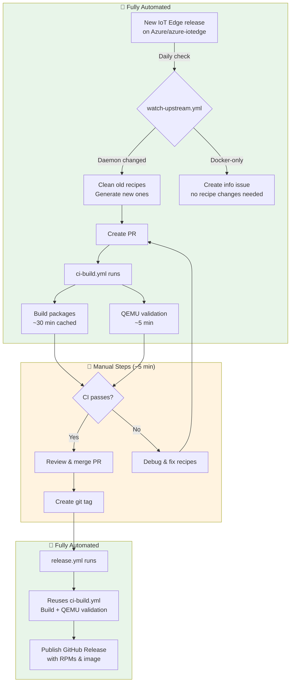

# Yocto + IoT Edge Release Guide

This guide covers the parallel IoT Edge release process on `main`:
IoT Edge 1.5.x for Yocto Scarthgap and IoT Edge 1.6.x for Yocto Wrynose.
Kirkstone uses templates on `main` and does not have a dedicated branch or CI
runs.

## Release Flow


```mermaid
flowchart TD
    subgraph Automated["🤖 Fully Automated"]
        A[New IoT Edge release<br/>on Azure/azure-iotedge] -->|Daily check| B{watch-upstream.yml}
        B -->|Daemon changed| C[Clean old recipes<br/>Generate new ones]
        B -->|Docker-only| D[Create info issue<br/>no recipe changes needed]
        C --> C2[Create PR]
        C2 --> E[ci-build.yml runs]
        E --> F[Build packages<br/>~30 min cached]
        E --> G[QEMU validation<br/>~5 min]
    end
    
    subgraph Manual["👤 Manual Steps (~5 min)"]
        F --> H{CI passes?}
        G --> H
        H -->|Yes| I[Review & merge PR]
        H -->|No| J[Debug & fix recipes]
        J --> C2
        I --> K[Create git tag]
    end
    
    subgraph Release["🤖 Fully Automated"]
        K --> L[release.yml runs]
        L --> M[Reuses ci-build.yml<br/>Build + QEMU validation]
        M --> N[Publish GitHub Release<br/>with RPMs & image]
    end
    
    style Automated fill:#e8f5e9
    style Manual fill:#fff3e0
    style Release fill:#e8f5e9
```

## On-Call Checklist

1. **Wait for automated PR** — `watch-upstream.yml` creates it daily at 6:00 UTC
2. **Check CI status** — Both "Build packages" and "QEMU validation" must pass
3. **Merge the PR**
4. **Tag the release** with the upstream release version (not the daemon version):

   ```bash
   git pull origin main
   git tag 1.5.35                 # Scarthgap / IoT Edge 1.5.x
   # or
   git tag 1.6.0                  # Wrynose / IoT Edge 1.6.x
   git push origin <tag>
   ```

   > **Note:** The tag matches the upstream release (for example, `1.5.35`)
   > even if the recipe filenames use the daemon version (for example,
   > `1.5.21`). The `.inc` file stores `IOTEDGE_RELEASE = "1.5.35"` for
   > traceability. A suffix such as `-1` identifies a Yocto-layer maintenance
   > revision without inventing a new upstream IoT Edge product version.

5. **Verify** — Check [GitHub Releases](https://github.com/Azure/meta-iotedge/releases)

## How Automation Works

### Version Detection

- **Source**: [product-versions.json](https://github.com/Azure/azure-iotedge/blob/main/product-versions.json) in Azure/azure-iotedge
- **Release version**: The overall product version (e.g., `1.5.35`) — used for git tags and stored as `IOTEDGE_RELEASE` in the version `.inc` file
- **Daemon version**: The `aziot-edge` component version (e.g., `1.5.21`) — used for recipe filenames, `VERSION` export, and `SRCREV` (the actual source that gets compiled)
- **Significant vs Docker-only**: If daemon version changed → update recipes; Docker-only → info issue

Some releases only update Docker images (e.g., agent, hub, diagnostics) while the daemon binaries stay
at an earlier version. Recipes must use the daemon version so the built binaries reference matching
container image tags. The `IOTEDGE_RELEASE` field tracks which upstream release the recipes correspond to.

The workflow uses `scripts/check-upstream.sh` to fetch `product-versions.json` and compare versions. You can run this locally to test:

```bash
./scripts/check-upstream.sh         # Key=value output
./scripts/check-upstream.sh --json  # JSON output
```

### GitHub Actions Workflows

| Workflow                 | Trigger                    | Purpose                                                |
| ------------------------ | -------------------------- | ------------------------------------------------------ |
| `watch-upstream.yml`     | Daily 6:00 UTC             | Detects new releases, generates recipes, creates PRs   |
| `ci-build.yml`           | PR/push events             | Builds packages, QEMU validation (self-hosted runner)  |
| `release.yml`            | Git tag push               | Publishes to GitHub Releases                           |
| `build-devcontainer.yml` | `.devcontainer/**` changes | Rebuilds devcontainer image                            |

> **Note:** CI runs on a self-hosted runner with persistent sstate-cache, making incremental builds much faster (~30 min vs ~4 hours). First builds or builds with recipe changes may take longer.

### Recipe Management

- Old recipes are automatically removed when updating to a new version
- Git tags preserve history — checkout a tag to get old recipes: `git checkout 1.5.5`

## Parallel Release Lines

`main` carries two active recipe lines at the same time. Tags can alternate
chronologically; they are not a single monotonically increasing product stream.

|Tag series|Yocto release|Template|Release title|
|---|---|---|---|
|`1.5.*`|Scarthgap (5.0 LTS)|`scarthgap`|Scarthgap / IoT Edge 1.5.x|
|`1.6.*`|Wrynose (6.0 LTS)|`wrynose`|Wrynose / IoT Edge 1.6.x|

Release automation compares generated notes with the previous tag in the same
series. Release notes identify both the Yocto release and IoT Edge line so a
later 1.5 maintenance release is not mistaken for a downgrade from 1.6.

The GitHub **Latest** marker follows the latest stable product generation:

- Before 1.6 GA, a stable 1.5 release remains Latest and 1.6 prereleases do not
  replace it.
- A stable 1.6 release becomes Latest.
- After 1.6 GA, later 1.5 maintenance releases remain supported releases but do
  not move Latest back to 1.5.

## Branch Mapping

| Branch | Yocto Release | Script Parameter |
| ------ | ------------- | ---------------- |
| main   | Scarthgap (5.0 LTS) | `scarthgap` |
| main   | Wrynose (6.0 LTS) | `wrynose` |
| main (templates only) | Kirkstone (out of support Apr'2026) | `kirkstone` |

## Manual Recipe Updates

When automation fails or you need manual control:

### Update Recipes

```bash
./scripts/update-recipes.sh --iotedge-version 1.5.35 --clean
```

The script:
1. Fetches `product-versions.json` from the specified IoT Edge release tag
2. Resolves git SHAs from version tags
3. Generates `*.bb` and `*.inc` template files
4. Parses `Cargo.lock` files to generate `*-crates.inc` (crate SRC_URI + sha256sums)

Recipes inherit `cargo-update-recipe-crates` from OE-Core, which enables the
`bitbake -c update_crates <recipe>` task. Crate data is stored in dedicated
`-crates.inc` files rather than inlined in `.bb` files.

Use `--keep-workdir` to debug generated files.

### Validate Recipes

Quick syntax check (~1 min):

```bash
./scripts/fetch.sh scarthgap
cd poky && source oe-init-build-env && bitbake -p iotedge aziot-edged
```

Full build (hours):

```bash
./scripts/build.sh scarthgap
```

QEMU validation (after build):

```bash
./scripts/validate-qemu.sh scarthgap
```

### Devcontainer

Both local development and CI use the same devcontainer image (`ghcr.io/<owner>/meta-iotedge-devcontainer:scarthgap`). In the devcontainer, `scripts/build.sh` runs `scripts/bitbake.sh` directly (no Docker nesting):

```bash
export DEVCONTAINER=1
export TEMPLATECONF="meta-iotedge/conf/templates/scarthgap"
./scripts/bitbake.sh iotedge aziot-edged
```

The CI workflow mounts a persistent cache directory at `/workspaces/yocto-cache` for sstate-cache and downloads, enabling fast incremental builds.
Kirkstone does not run in CI; the templates are validated but builds are manual.

## QEMU Validation

The `validate-qemu.sh` script boots the QEMU image and checks:

- `iotedge --version` — CLI installed
- `iotedge check --verbose` — Diagnostics
- Service status — keyd, certd, tpmd, identityd, aziot-edged

**Mock config (default):**

By default, the script creates a mock IoT Edge configuration with a placeholder hub (`example.azure-devices.net`). This allows all services to start:

- ✅ All services running: keyd, certd, tpmd, identityd, aziot-edged
- ⚠️ Connectivity errors expected (mock hub doesn't exist)
- ✅ Confirms packages installed and services functional

Use `--no-mock-config` to skip the mock configuration if testing with a real Azure IoT Hub config.

**Without any config (`--no-mock-config`):**

- ✅ Services running: keyd, certd, tpmd, identityd
- ⚠️ Configuration warnings (no config.toml)
- ❌ aziot-edged needs config to fully start

### Manual SSH Access

```bash
sshpass -p '' ssh -o StrictHostKeyChecking=no -p 2222 root@localhost
```

## Troubleshooting

### SRCREV = "main" errors

```text
ERROR: iotedge: Fetcher failure: Unable to find revision main in branch main
```

Recipe has branch names instead of commit SHAs. Run `update-recipes.sh` or manually fix `SRCREV_*` entries to 40-character git SHAs.

### Missing SOCKET_DIR error

```text
error: environment variable `SOCKET_DIR` not defined at compile time
```

Ensure the recipe's `.inc` file exports: `export SOCKET_DIR="/run/aziot"`

### Missing docker group error

```text
useradd: group 'docker' does not exist
```

Ensure `GROUPADD_PARAM:${PN} = "-r iotedge; -r docker"` in the recipe.

### Recipe parsing errors

```bash
cd poky && source oe-init-build-env && bitbake -p iotedge aziot-edged
```

## Future Work

- **ARM64 builds** — Raspberry Pi and similar devices
- **Azure IoT Hub integration tests** — End-to-end connectivity validation
- **TPM-optional builds** — MACHINE_FEATURES-based toggle (see [#149](https://github.com/Azure/meta-iotedge/issues/149))
