# Yocto + IoT Edge release guide

This guide describes how to update recipes for a new IoT Edge and/or IoT Identity Service release, and how to validate for Scarthgap (main) and Kirkstone (kirkstone).

## Automated release flow

Most of the release process is automated. Here's how it works:

```mermaid
flowchart TD
    subgraph Automated["🤖 Fully Automated"]
        A[New IoT Edge release<br/>on Azure/azure-iotedge] -->|Daily check| B{watch-upstream.yml}
        B -->|Daemon or IIS changed| C[Clean old recipes<br/>Generate new ones]
        B -->|Docker-only| D[Create info issue<br/>no recipe changes needed]
        C --> C2[Create PR]
        C2 --> E[ci-build.yml runs]
        E --> F[Build packages<br/>~4 hours]
        E --> G[QEMU validation<br/>~30 min]
    end
    
    subgraph Manual["👤 Manual Steps (~5 min)"]
        F --> H{CI passes?}
        G --> H
        H -->|Yes| I[Review & merge PR]
        H -->|No| J[Debug & fix recipes]
        J --> C2
        I --> K[Create git tag]
    end
    
    subgraph Release["🤖 Fully Automated"]
        K --> L[release.yml runs]
        L --> M[Reuses ci-build.yml<br/>Build + QEMU validation]
        M --> N[Publish GitHub Release<br/>with RPMs & image]
    end
    
    style Automated fill:#e8f5e9
    style Manual fill:#fff3e0
    style Release fill:#e8f5e9
```



### What on-call needs to do

1. **Wait for automated PR** - watch-upstream.yml creates it automatically (daily at 6:00 UTC)
2. **Check CI status** - Both "Build packages" and "QEMU validation" should pass
3. **Merge the PR** - Click merge after CI passes
4. **Tag the release** (the PR description includes the exact commands):
   ```bash
   git pull origin main
   git tag 1.5.35
   git push origin 1.5.35
   ```
5. **Verify release** - Check [GitHub Releases](https://github.com/Azure/meta-iotedge/releases)

### Version management

- **Version source**: [Azure/azure-iotedge](https://github.com/Azure/azure-iotedge/releases) combined releases
- **Daemon version detection**: Extracted from release asset names (e.g., `aziot-edge-1.5.21-*.rpm`) by searching for the most recent release with package assets
- **Recipe version**: Always matches the latest release (e.g., 1.5.35), even if daemon binary is from an earlier version (e.g., 1.5.21). The source code at tag 1.5.35 still builds correctly.
- **Significant vs Docker-only**: If daemon or IIS version changed → update recipes. If only Docker images changed → create info issue.
- **Old recipes are automatically removed** when updating to a new version
- **Git tags preserve history** - to get old recipes, checkout the tag: `git checkout 1.5.5`
- **GitHub Releases** contain pre-built RPMs and QEMU images for each version

## Current versions

| Component | Version | SRCREV |
|-----------|---------|--------|
| IoT Edge | 1.5.5 | `38324d1c707d5e1f848a5fcfb7daa86e5ee49e76` |
| IoT Identity Service | 1.5.0 | `7a4e1a1fa9a4c2a37c3186c9b7a204ce384b2caa` |
| Yocto | Scarthgap | 5.0 LTS |

> **Note**: The version detection now reads from actual recipe files in `recipes-core/`, not this table.
> This table is for documentation purposes only.

## Quick summary

- **main** tracks **Scarthgap**.
- **kirkstone** tracks **Kirkstone**.
- Dunfell and earlier are out of support.

## Prerequisites

- Rust toolchain is taken from the upstream repos via their `rust-toolchain.toml`. You **do not** need to pin a specific Rust version in this repo.
- Install cargo-bitbake once:
  - `cargo install --locked cargo-bitbake`

## Release inputs

You need the release commit SHAs for:

- **IoT Edge** repo: https://github.com/Azure/iotedge
- **IoT Identity Service** repo: https://github.com/Azure/iot-identity-service

And the corresponding version numbers (for example, `1.5.34`).

## Update recipes (automated)

Use the helper script in this repo to generate and patch recipes from the upstream repos:

```
./scripts/update-recipes.sh \
  --iotedge-rev <iotedge_sha> --iotedge-version 1.5.34 \
  --iis-rev <iis_sha> --iis-version 1.5.6
```

What it does:

- Generates `*.bb` and `*.inc` via cargo-bitbake for IoT Edge and IoT Identity Service.
- Normalizes cargo sources and registry configuration to crates.io.
- Sets `CARGO_SRC_DIR` for monorepo subpaths where needed.
- Fixes license checksums and applies known recipe patches (e.g., `pkgconfig` inherits).
- Resolves IIS SRCREV entries to actual git SHAs (not branch names).
- Fixes IIS git dependencies with proper subpath handling.
- Adds known crate checksums (e.g., wasi crates).

Notes:

- If **only** IoT Edge changes, omit the `--iis-*` flags. The script will automatically
  resolve the latest IIS release tag for SRCREV entries.
- If **only** IoT Identity Service changes, omit the `--iotedge-*` flags.
- The script creates new `*.bb` and `*.inc` files alongside existing versions; it does **not** delete older versions.
- Use `--keep-workdir` to inspect generated files for debugging.

## Validate recipes

After updating recipes, validate that they parse correctly before running a full build:

```bash
# Fetch Yocto layers for the target release
./scripts/fetch.sh scarthgap

# Parse recipes to check for errors (quick validation)
cd poky && source oe-init-build-env && bitbake -p iotedge aziot-edged
```

This validates:
- Recipe syntax is correct
- All SRCREV entries are valid git SHAs (not branch names like "main")
- Dependencies resolve correctly

## Validate build (local or CI)

For a full build validation:

```bash
# Fetch Yocto layers (use Yocto branch name: scarthgap, kirkstone, etc.)
./scripts/fetch.sh scarthgap

# Build recipes (uses scarthgap template by default)
./scripts/build.sh
```

To validate IoT Edge in QEMU:

```bash
./scripts/validate-qemu.sh scarthgap
```

### Script parameters

| Script | Parameter | Description | Examples |
|--------|-----------|-------------|----------|
| `fetch.sh` | `<yocto-branch>` | Yocto release branch to fetch | `scarthgap`, `kirkstone` |
| `build.sh` | `<template>` | Build template from `conf/templates/` | `scarthgap`, `kirkstone` |
| `validate-qemu.sh` | `<template>` | Template for QEMU validation | `scarthgap`, `kirkstone` |

### Branch to template mapping

| Branch | Yocto Release | fetch.sh | build.sh |
|--------|---------------|----------|----------|
| main | Scarthgap | `scarthgap` | `scarthgap` |
| kirkstone | Kirkstone | `kirkstone` | `kirkstone` |

### Script explanations

- `scripts/fetch.sh`: clones required Yocto layers (poky, meta-openembedded, etc.) at the specified Yocto branch. Supports optional GitHub mirrors/fallbacks.
- `scripts/build.sh`: runs the containerized build and invokes BitBake for the main IoT Edge targets using the specified template.
- `scripts/containerize.sh`: wraps Docker to run builds consistently and passes timeouts/UID/GID through.
- `scripts/bitbake.sh`: sets up the OE environment and starts BitBake with longer server/client timeouts.

### Devcontainer note

If you reopen the repo in the devcontainer (public Yocto image), `scripts/build.sh` will run
`scripts/bitbake.sh` directly and skip Docker nesting. You can also run bitbake directly:

```bash
export DEVCONTAINER=1
export TEMPLATECONF="meta-iotedge/conf/templates/scarthgap"
./scripts/bitbake.sh iotedge aziot-edged
```

### Build notes

- Full Yocto builds can exceed GitHub-hosted runner limits (time/disk). For CI reliability, prefer a **self-hosted runner** with sstate caches.
- Templates set `BB_FETCH_RETRIES` and `BB_FETCH_TIMEOUT` for network robustness, and keep `BB_HASHSERVE = ""` to avoid hashserv socket issues in Codespaces.

## QEMU validation

The `validate-qemu.sh` script boots the built QEMU image and validates IoT Edge is working:

```bash
./scripts/validate-qemu.sh scarthgap
```

### What it validates

1. **iotedge --version** - Confirms IoT Edge CLI is installed
2. **iotedge check --verbose** - Runs comprehensive diagnostics (some failures expected without Azure config)
3. **aziot-edged service** - Checks the Edge daemon status
4. **aziot-identityd service** - Checks the Identity Service status
5. **Installed packages** - Lists all IoT Edge RPMs

### Expected output

Without Azure IoT Hub configuration, you'll see:
- ✅ Services running: keyd, certd, tpmd, identityd
- ⚠️ Configuration errors (no config.toml)
- ⚠️ Connectivity warnings (no Azure connection)
- ❌ aziot-edged failed (needs config to start)

This is **normal** - it confirms packages are installed correctly. Full functionality requires Azure IoT Hub provisioning.

### SSH access

The QEMU image uses `debug-tweaks` which enables root SSH with an empty password. The script uses `sshpass` for automated authentication:

```bash
# Manual SSH (if QEMU is still running)
sshpass -p '' ssh -o StrictHostKeyChecking=no -p 2222 root@localhost
```

## Update meta-rust (if needed)

If the build fails due to Rust version incompatibility:

- Update `METARUST_REV` in builds/checkin.yaml to a commit that adds support for the needed Rust version.

## Branching rules

- **Scarthgap** updates go to **main**.
- **Kirkstone** updates go to **kirkstone**.

Create a PR with the updated recipes and validate as above.

## Automation (GitHub Actions)

### Recipe updates

The workflow in [.github/workflows/update-recipes.yml](../.github/workflows/update-recipes.yml)
can generate updated recipes and open a PR. Trigger it via **Actions → Update Yocto recipes**
with the desired SHAs and versions.

### Automated upstream watching

The workflow in [.github/workflows/watch-upstream.yml](../.github/workflows/watch-upstream.yml)
runs daily and automatically:

1. Checks for new releases in [Azure/azure-iotedge](https://github.com/Azure/azure-iotedge/releases) (the combined release repo)
2. Extracts daemon and IIS versions from release assets (e.g., `aziot-edge-1.5.21-*.rpm`)
3. Compares with current versions in recipe files (`recipes-core/*/component_*.bb`)
4. **If significant changes** (daemon/IIS updates): Creates a PR with updated recipes, tagged with latest release version
5. **If Docker-only changes**: Creates an informational issue suggesting optional tag creation

This means most upstream releases are handled automatically. You just need to review and merge the PRs.

### CI validation

The workflow in [.github/workflows/ci-build.yml](../.github/workflows/ci-build.yml) runs on every PR with two checks:

| Check | Description | Duration |
|-------|-------------|----------|
| **Build packages** | Compiles all IoT Edge packages | ~2-4 hours |
| **QEMU validation** | Boots image and runs `iotedge check` | ~30 min |

Both checks appear as separate status checks on PRs, so you can see at a glance if packages build and if they work in QEMU.

### Releases

The workflow in [.github/workflows/release.yml](../.github/workflows/release.yml) automatically creates GitHub releases when you push a tag:

```bash
git tag 1.5.35
git push origin 1.5.35
```

This calls the ci-build workflow (reusing build logic), runs QEMU validation, then publishes artifacts to [GitHub Releases](https://github.com/Azure/meta-iotedge/releases).

> **Note:** Tags use format `1.5.x` (no `v` prefix) to match upstream Azure/iotedge releases.

## End-to-end release checklist

1. **Update recipes**
   ```bash
   ./scripts/update-recipes.sh \
     --iotedge-rev <sha> --iotedge-version <ver> \
     --iis-rev <sha> --iis-version <ver>
   ```

2. **Validate recipe parsing** (quick, ~1 min)
   ```bash
   ./scripts/fetch.sh scarthgap
   cd poky && source oe-init-build-env && bitbake -p iotedge aziot-edged
   ```

3. **Full build validation** (slow, hours)
   ```bash
   ./scripts/build.sh scarthgap
   ```

4. **QEMU validation** (after build completes)
   ```bash
   ./scripts/validate-qemu.sh scarthgap
   ```

5. **Create PR** targeting the appropriate branch (main for Scarthgap, kirkstone for Kirkstone)

6. **Tag and release** (after PR merges)
   ```bash
   git tag 1.5.35
   git push origin 1.5.35
   ```

## Troubleshooting

### SRCREV = "main" errors

If BitBake fails with errors about unable to fetch a git revision like "main":

```
ERROR: iotedge: Fetcher failure: Unable to find revision main in branch main
```

This means the recipe has SRCREV entries pointing to branch names instead of commit SHAs.
The `update-recipes.sh` script should automatically fix these, but if updating manually,
ensure all `SRCREV_*` entries are valid 40-character git commit SHAs.

### Recipe parsing errors

Run `bitbake -p <recipe>` to validate recipe syntax without building:

```bash
cd poky && source oe-init-build-env
bitbake -p iotedge aziot-edged
```

### Missing SOCKET_DIR error

If the build fails with:

```
error: environment variable `SOCKET_DIR` not defined at compile time
```

Ensure the recipe's `.inc` file exports `SOCKET_DIR`:

```
export SOCKET_DIR="/run/aziot"
```

### Missing docker group error

If the build fails with:

```
useradd: group 'docker' does not exist
```

Ensure the recipe's `GROUPADD_PARAM` creates the docker group:

```
GROUPADD_PARAM:${PN} = "-r iotedge; -r docker"
```

### When manual fixes are still needed

Most release steps are automated. Manual intervention may still be required if
upstream changes introduce new build or recipe issues, for example:

- Additional devtool patches (e.g., bindgen for `aziot-keyd`, rustdoc warnings).
- Regenerating missing `SRC_URI` checksums reported by BitBake.

## Future work

The following improvements are planned but not yet implemented:

### 1. Kirkstone QEMU validation

Currently QEMU validation only runs for Scarthgap. Add support for Kirkstone branch validation.

### 2. ARM64 builds

Add support for building and validating ARM64 (aarch64) targets for Raspberry Pi and similar devices.

### 3. Azure IoT Hub integration tests

Add optional provisioning with a test IoT Hub to validate full end-to-end connectivity.
